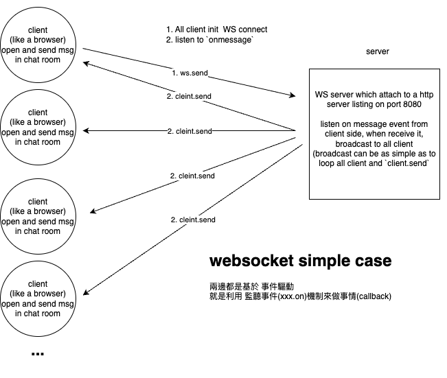

# WS concept

## 概念


## server 端
```
npm i 
npm run dev
```


## client 端
打開數個瀏覽器, 模擬多人使用聊天室
網址為 http://localhost:8080/


## ref:
https://dev.to/devland/build-a-real-time-chat-app-using-nodejs-and-websocket-441g